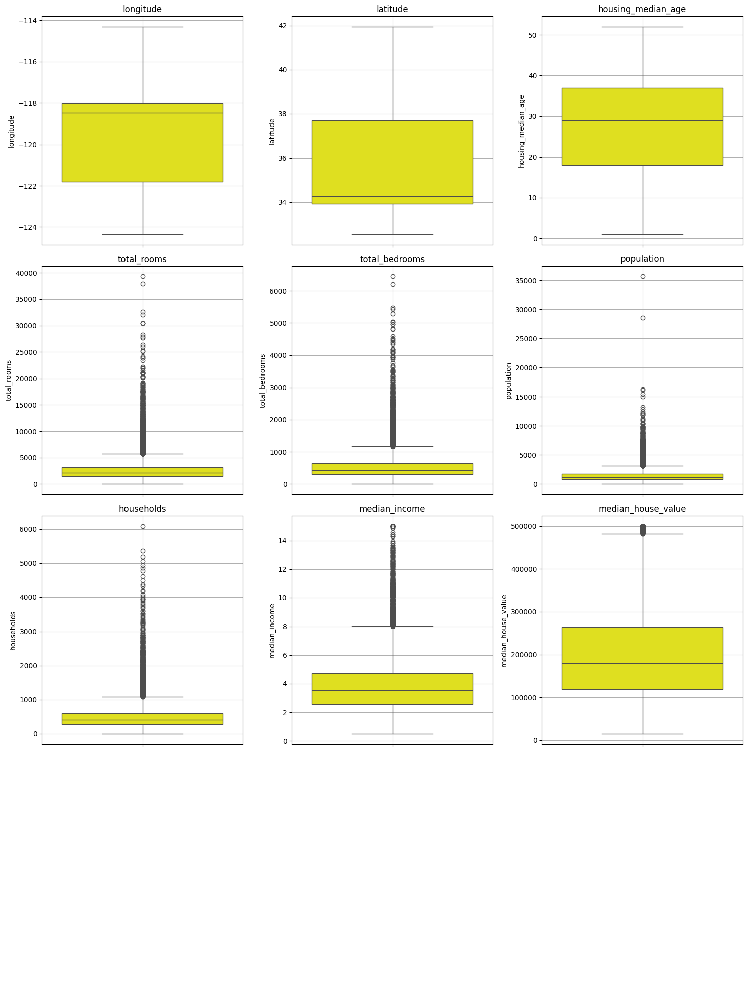
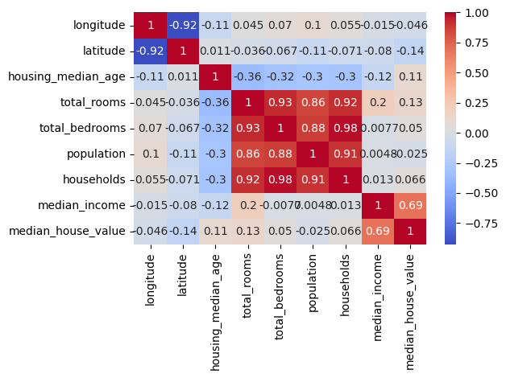

# California Housing Ocean Proximity Classification

## Project Overview

This project implements a machine learning pipeline to classify ocean proximity categories in the California Housing dataset using a Random Forest Classifier with SMOTE for handling class imbalance.

## Dataset

The dataset contains housing information from California districts collected from the 1990 census. Key features include:

| Feature | Description |
|---------|-------------|
| longitude | Geographic coordinate |
| latitude | Geographic coordinate |
| housing_median_age | Median age of houses in district |
| total_rooms | Total number of rooms |
| total_bedrooms | Total number of bedrooms |
| population | District population |
| households | Number of households |
| median_income | Median income in district |
| median_house_value | Median house value |
| ocean_proximity | Target variable (categorical) |

### Target Classes

| Class | Label | Description |
|-------|-------|-------------|
| near bay | 0 | Properties near the bay |
| <1h ocean | 1 | Properties within 1 hour from ocean |
| inland | 2 | Inland properties |
| near ocean | 3 | Properties near the ocean |
| island | 4 | Island properties |

## Methodology

### 1. Exploratory Data Analysis (EDA)

- Data shape and structure analysis (20,640 samples, 10 features)
- Statistical summary of all features
- Missing value detection (207 missing values in `total_bedrooms`)
- Duplicate record check (no duplicates found)
- Histogram visualizations for numerical features
- Bar charts for categorical features
- Box plots for outlier detection
- Correlation heatmap for numerical features

### Visualizations

#### Histograms and Bar Charts

#### Boxplots for Outlier Detection

#### Correlation Heatmap

### 2. Data Preprocessing

- Data type standardization for numerical columns
- String normalization (strip whitespace, lowercase conversion)
- Categorical values standardized to consistent format
- Removal of columns with >50% missing values (none in this dataset)
- Duplicate removal

### 3. Train-Test Split

- 80% training, 20% testing split
- Stratified sampling to maintain class distribution
- Random state = 42 for reproducibility

### 4. Machine Learning Pipeline

The pipeline consists of three main components:

#### Preprocessor (ColumnTransformer)
- **Numerical features**: Median imputation + StandardScaler
- **Categorical features**: Mode imputation + OneHotEncoder (drop first)

#### SMOTE (Synthetic Minority Over-sampling Technique)
- k_neighbors = 2
- Random state = 42
- Addresses class imbalance, particularly for the "island" class

#### Classifier
- Random Forest Classifier
- n_estimators = 100
- Random state = 42

## Results

### Model Performance

| Metric | Score |
|--------|-------|
| Accuracy | 97.80% |

### Classification Report

| Class | Precision | Recall | F1-Score | Support |
|-------|-----------|--------|----------|---------|
| near bay (0) | 0.97 | 0.99 | 0.98 | 458 |
| <1h ocean (1) | 0.98 | 0.98 | 0.98 | 1,827 |
| inland (2) | 0.99 | 0.99 | 0.99 | 1,310 |
| near ocean (3) | 0.94 | 0.95 | 0.94 | 532 |
| island (4) | 0.00 | 0.00 | 0.00 | 1 |

**Note**: The island class (4) had insufficient samples (only 1 in test set) for reliable classification.

### Confusion Matrix

The model performs excellently across majority classes with 98% weighted average accuracy. The "island" class has no predictions due to severe underrepresentation.

## Key Findings

- No duplicate records in dataset
- `total_bedrooms` had 207 missing values (handled with median imputation)
- Significant class imbalance - island category severely underrepresented
- Strong correlations between `total_rooms`, `total_bedrooms`, `households`, and `population`

## Limitations

- Island class cannot be reliably classified due to insufficient samples (only 1 in test set)
- Additional data collection needed for minority classes
- SMOTE with k_neighbors=2 helps but cannot fully compensate for extreme imbalance

## Future Improvements

1. Collect more data for minority classes (especially island properties)
2. Experiment with alternative oversampling techniques (ADASYN, Borderline-SMOTE)
3. Try ensemble methods or anomaly detection for rare classes
4. Engineer new features (rooms_per_household, population_per_household, bedrooms_per_room)

## Requirements
